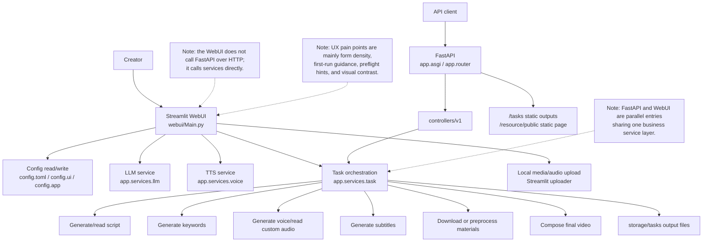
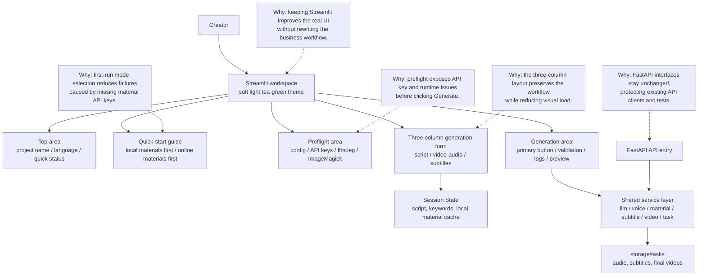

<div align="center">
<h1 align="center">AI-NewMedia 🎬</h1>

<p align="center">
  <a href="https://github.com/bruceleeu-creator/AI-NewMedia/stargazers"></a>
  <a href="https://github.com/bruceleeu-creator/AI-NewMedia/issues"></a>
  <a href="https://github.com/bruceleeu-creator/AI-NewMedia/forks"></a>
  <a href="https://github.com/bruceleeu-creator/AI-NewMedia/blob/master/LICENSE"></a>
</p>

<h3>English | <a href="README.md">简体中文</a></h3>

AI-NewMedia is an AI short-video production workspace for new media creators. Provide a <b>topic</b> or <b>keyword</b>, then generate scripts, materials, subtitles, voice, background music, and final HD short videos in one workflow.

The project includes a softer, low-contrast WebUI designed for repeated script, media, voice, and subtitle tuning.

### WebUI


### API Interface


</div>

## Features 🎯

- [x] Complete **MVC architecture**, **clearly structured** code, easy to maintain, supports both `API` and `Web interface`
- [x] Supports **AI-generated** video script, as well as **custom script**
- [x] Supports various **high-definition video** sizes
    - [x] Portrait 9:16, `1080x1920`
    - [x] Landscape 16:9, `1920x1080`
- [x] Supports **batch video generation** - create multiple videos at once, then select the best one
- [x] Configurable **video clip duration** for adjusting material switching frequency
- [x] Supports video script in both **Chinese** and **English**
- [x] Supports **multiple voice** synthesis with **real-time preview**
- [x] Supports **subtitle generation** with adjustable `font`, `position`, `color`, `size`, and `subtitle outline`
- [x] Supports **background music** - random or custom music files with adjustable volume
- [x] HD **royalty-free** video materials, with support for **local materials**
- [x] Supports integration with **OpenAI**, **Moonshot**, **Azure**, **gpt4free**, **one-api**, **Qwen**, **Google Gemini**, **Ollama**, **DeepSeek**, **MiniMax**, **ERNIE**, **Pollinations**, **ModelScope** and more

## Architecture & WebUI Optimization 🧭

AI-NewMedia keeps `Streamlit WebUI` as the real frontend. It does not split the product into a separate React / Vue app. The WebUI directly calls `app.services` for scripts, materials, voice, subtitles, and video composition. FastAPI remains a parallel API entry for API clients, and both entries share the same service layer.

### Current Architecture



### Target Optimization Architecture



Optimization focus:

- Use a soft, low-contrast tea-green light theme instead of dark or high-contrast controls.
- Add a quick-start area that defaults to local materials first, so first-time users can run the flow without Pexels / Pixabay keys.
- Add startup preflight checks for `config.toml`, LLM keys, material keys, ffmpeg, and ImageMagick without blocking manual scripts or local uploads.
- Keep the three-column business form and improve hierarchy, spacing, card boundaries, and scanability.
- Keep FastAPI routes, API schemas, and `app.services` compatible.

## System Requirements 📦

- Recommended platforms: Windows 10+, macOS 11+, or a mainstream Linux distribution
- GPU is not required, but recommended for faster local transcription, video processing, and smoother batch generation

| Item | Minimum | Recommended | Optimal |
| --- | --- | --- | --- |
| CPU | 4 cores | 6 to 8 cores | 8+ cores |
| RAM | 4 GB | 8 GB | 16+ GB |
| GPU | Not required | 4+ GB VRAM | 8+ GB VRAM |

- If you mainly rely on cloud LLM, cloud TTS, and online material sources, CPU and RAM matter more than GPU
- If you use `faster-whisper`, batch generation, or heavier local processing, a GPU will improve throughput noticeably

## Quick Start 🚀

### Recommended Path: One-Click WebUI Startup

AI-NewMedia's default entry is the WebUI. For the first run, use "local materials first": upload local images or videos and run the workflow without applying for Pexels / Pixabay keys first.

#### ① Clone the Project

```shell
git clone https://github.com/bruceleeu-creator/AI-NewMedia.git
cd AI-NewMedia
```

#### ② Install uv and Python Dependencies

Recommended: use [uv](https://docs.astral.sh/uv/) with Python `3.11`.

```shell
uv python install 3.11
uv sync --frozen
```

#### ③ Start the WebUI

macOS / Linux:

```shell
sh start-webui.sh
```

Windows:

```bat
start-webui.bat
```

The launcher will:

- Create `config.toml` from `config.example.toml` when missing
- Check LLM, material source, TTS, ffmpeg, and ImageMagick status
- Try the next available port when `8501` is occupied
- Print the WebUI URL

#### ④ Generate Your First Video

In the WebUI, start with **local materials first**:

1. Upload local images or videos
2. Enter a video subject, or paste a finished script
3. Choose voice, subtitles, and background music
4. Click **Generate Video**

Switch to **online materials first** only when you want automatic material search, then add a Pexels or Pixabay API key in Basic Settings.

### Docker Deployment 🐳

#### ① Launch Docker

If you haven't installed Docker: https://www.docker.com/products/docker-desktop/

```shell
cd AI-NewMedia
docker-compose up
```

> Note: Latest Docker versions bundle docker compose as a plugin - use `docker compose up`

#### ② Access Web Interface

Visit http://0.0.0.0:8501

#### ③ Access API Docs

Visit http://0.0.0.0:8080/docs or http://0.0.0.0:8080/redoc

### Manual Deployment 📦

#### ① Create Virtual Environment

Recommended to use [uv](https://docs.astral.sh/uv/) with Python `3.11`

```shell
git clone https://github.com/bruceleeu-creator/AI-NewMedia.git
cd AI-NewMedia
uv python install 3.11
uv sync --frozen
```

Alternatively with `venv + pip`:

```shell
python3.11 -m venv .venv
source .venv/bin/activate
pip install -r requirements.txt
```

#### ② Install ImageMagick

**Windows:**
- Download the **static** version from https://imagemagick.org/script/download.php
- Install without changing the installation path
- Set `imagemagick_path` in `config.toml` to the actual installation path

**MacOS:**
```shell
brew install imagemagick
```

**Ubuntu:**
```shell
sudo apt-get install imagemagick
```

**CentOS:**
```shell
sudo yum install ImageMagick
```

#### ③ Launch Web Interface 🌐

Run from the project **root directory**:

**Windows:**
```shell
uv run python scripts/start_webui.py
```
Or if virtual env is active:
```bat
webui.bat
```

**MacOS or Linux:**
```shell
uv run python scripts/start_webui.py
```
Or if virtual env is active:
```shell
sh webui.sh
```

#### ④ Launch API Service 🚀

```shell
uv run python main.py
```

Or if virtual env is active:
```shell
python main.py
```

API docs at http://127.0.0.1:8080/docs or http://127.0.0.1:8080/redoc

## Voice Synthesis 🗣

All supported voices: [Voice List](./docs/voice-list.txt)

## Subtitle Generation 📜

Two subtitle generation methods:

- **edge**: Fast generation, no special hardware required, quality may vary
- **whisper**: Slower, requires more hardware, more reliable quality

Switch via `subtitle_provider` in `config.toml`. Leave empty to skip subtitles.

> whisper mode requires downloading a ~3GB model from HuggingFace

Download links for `whisper-large-v3` (China users):

- Baidu Netdisk: https://pan.baidu.com/s/11h3Q6tsDtjQKTjUu3sc5cA?pwd=xjs9
- Quark Netdisk: https://pan.quark.cn/s/3ee3d991d64b

Extract to `.\AI-NewMedia\models\whisper-large-v3`

## Background Music 🎵

Place music files in `resource/songs/`. Some default tracks are included.

## Subtitle Fonts 🅰

Fonts are located in `resource/fonts/`. Add your own fonts as needed.

## Common Questions 🤔

### ffmpeg not found

Download from https://www.gyan.dev/ffmpeg/builds/ and set `ffmpeg_path` in config:
```toml
[app]
ffmpeg_path = "C:\\path\\to\\ffmpeg.exe"
```

### ImageMagick security policy

Modify `policy.xml` (usually in `/etc/ImageMagick-X/`), change `pattern="@"` entry from `rights="none"` to `rights="read|write"`.

### Too many open files

```shell
ulimit -n 10240
```

## Feedback & Suggestions 📢

- Submit an [issue](https://github.com/bruceleeu-creator/AI-NewMedia/issues) or [pull request](https://github.com/bruceleeu-creator/AI-NewMedia/pulls).

## License 📝

See [`LICENSE`](LICENSE) file.
