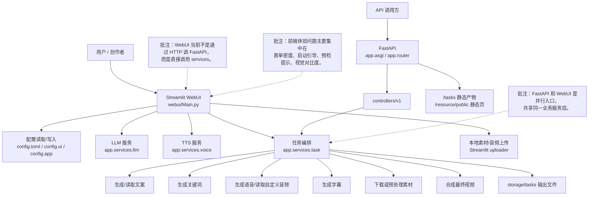
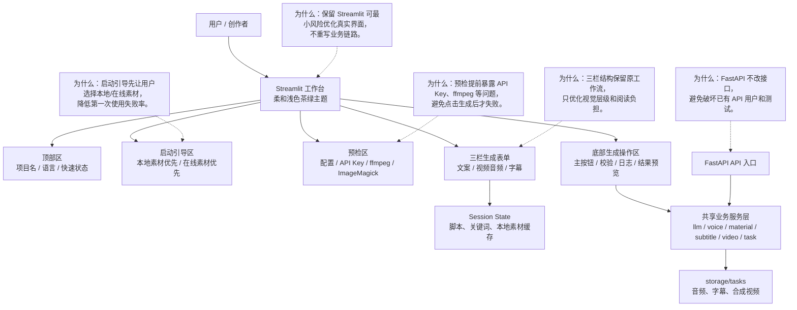

<div align="center">
<h1 align="center">AI-NewMedia 🎬</h1>

<p align="center">
  <a href="https://github.com/bruceleeu-creator/AI-NewMedia/stargazers"></a>
  <a href="https://github.com/bruceleeu-creator/AI-NewMedia/issues"></a>
  <a href="https://github.com/bruceleeu-creator/AI-NewMedia/forks"></a>
  <a href="https://github.com/bruceleeu-creator/AI-NewMedia/blob/master/LICENSE"></a>
</p>
<br>
<h3>简体中文 | <a href="README-en.md">English</a></h3>
<br>
AI-NewMedia 是一个面向新媒体内容生产的 AI 短视频生成工作台。只需提供一个视频 <b>主题</b> 或 <b>关键词</b>，即可辅助生成视频文案、素材、字幕、语音和背景音乐，并合成高清短视频。
<br>
项目提供柔和低对比度的 WebUI，适合反复调试脚本、素材、配音和字幕参数。
<br>

<h4>Web界面</h4>


<h4>API界面</h4>


</div>

## 功能特性 🎯

- [x] 完整的 **MVC架构**，代码 **结构清晰**，易于维护，支持 `API` 和 `Web界面`
- [x] 支持视频文案 **AI自动生成**，也可以**自定义文案**
- [x] 支持多种 **高清视频** 尺寸
    - [x] 竖屏 9:16，`1080x1920`
    - [x] 横屏 16:9，`1920x1080`
- [x] 支持 **批量视频生成**，可以一次生成多个视频，然后选择一个最满意的
- [x] 支持 **视频片段时长** 设置，方便调节素材切换频率
- [x] 支持 **中文** 和 **英文** 视频文案
- [x] 支持 **多种语音** 合成，可 **实时试听** 效果
- [x] 支持 **字幕生成**，可以调整 `字体`、`位置`、`颜色`、`大小`，同时支持`字幕描边`设置
- [x] 支持 **背景音乐**，随机或者指定音乐文件，可设置`背景音乐音量`
- [x] 视频素材来源 **高清**，而且 **无版权**，也可以使用自己的 **本地素材**
- [x] 支持 **OpenAI**、**Moonshot**、**Azure**、**gpt4free**、**one-api**、**通义千问**、**Google Gemini**、**Ollama**、**DeepSeek**、**MiniMax**、 **文心一言**, **Pollinations**、**ModelScope** 等多种模型接入
    - 中国用户建议使用 **DeepSeek** 或 **Moonshot** 作为大模型提供商（国内可直接访问，不需要VPN。注册就送额度，基本够用）

## 架构与前端优化方案 🧭

本项目保留 `Streamlit WebUI` 作为真实前端入口，不拆独立 React / Vue。WebUI 直接调用 `app.services` 完成文案、素材、语音、字幕和视频合成；FastAPI 主要面向 API 调用方，两者共享同一套业务服务层。

### 当前架构



### 优化后目标架构



优化重点：

- 固定浅色低对比茶绿色主题，减少黑色控件和强对比造成的阅读负担。
- 顶部增加快速启动模式，默认推荐本地素材优先，降低第一次使用时因素材 API Key 缺失导致的失败率。
- 启动预检提前提示 `config.toml`、大模型 API Key、素材源 API Key、ffmpeg、ImageMagick 等状态，但不阻塞手动填写文案或上传本地素材。
- 保留三栏业务表单，只优化标题、间距、卡片边界和可扫描性，避免打断原有使用习惯。
- FastAPI 路由、接口 schema 和 `app.services` 服务层保持兼容，降低回归风险。

## 配置要求 📦

- 建议系统：Windows 10 或 MacOS 11.0 以上，或主流 Linux 发行版
- GPU 不是必需项，但如果你希望本地转录、更快的视频处理或更顺畅的批量生成体验，建议使用带显存的独立显卡

| 项目 | 最低配置 | 推荐配置 | 理想配置 |
| --- | --- | --- | --- |
| CPU | 4 核 | 6 到 8 核 | 8 核及以上 |
| RAM | 4 GB | 8 GB | 16 GB 及以上 |
| GPU | 非必须 | 4 GB 显存及以上 | 8 GB 显存及以上 |

- 如果你主要依赖云端 LLM、云端 TTS 和在线素材源，CPU 与内存比 GPU 更重要
- 如果你启用 `faster-whisper`、批量生成或更重的本地处理链路，GPU 会明显提升速度


## 快速开始 🚀

### 推荐路径：一键启动 WebUI

AI-NewMedia 的默认入口是 WebUI。第一次使用建议先走“本地素材快速体验”：不用先申请 Pexels / Pixabay Key，上传图片或视频即可先跑通一条生成链路。

#### ① 克隆代码

```shell
git clone https://github.com/bruceleeu-creator/AI-NewMedia.git
cd AI-NewMedia
```

#### ② 安装 uv 和 Python 依赖

推荐使用 [uv](https://docs.astral.sh/uv/) 管理 Python 环境，默认使用 Python `3.11`。

```shell
uv python install 3.11
uv sync --frozen
```

#### ③ 一键启动 WebUI

MacOS / Linux:

```shell
sh start-webui.sh
```

Windows:

```bat
start-webui.bat
```

启动器会自动：
- 如果缺少 `config.toml`，从 `config.example.toml` 复制一份
- 检查大模型、素材源、TTS、ffmpeg、ImageMagick 等基础状态
- 遇到 `8501` 端口占用时自动尝试后续端口
- 打印可访问的 WebUI 地址

#### ④ 第一次生成视频

打开 WebUI 后，优先选择顶部的 **本地素材快速体验**：

1. 上传本地图片或视频素材
2. 填写视频主题，或者直接粘贴视频文案
3. 选择语音、字幕和背景音乐
4. 点击 **生成视频**

如果你想让系统自动找素材，再切换到 **在线素材全自动生成**，并在基础设置中填写 Pexels 或 Pixabay API Key。

### 高级方式：Docker 部署 🐳

如果未安装 Docker，请先安装 https://www.docker.com/products/docker-desktop/

如果是Windows系统，请参考微软的文档：

1. https://learn.microsoft.com/zh-cn/windows/wsl/install
2. https://learn.microsoft.com/zh-cn/windows/wsl/tutorials/wsl-containers

```shell
cd AI-NewMedia
docker-compose up
```

> 注意：最新版的docker安装时会自动以插件的形式安装docker compose，启动命令调整为docker compose up

访问 WebUI:

打开浏览器，访问 http://127.0.0.1:8501

访问 API 文档:

打开浏览器，访问 http://127.0.0.1:8080/docs 或者 http://127.0.0.1:8080/redoc

### 高级方式：手动部署 📦

#### ① 创建虚拟环境

推荐使用 [uv](https://docs.astral.sh/uv/) 管理 Python 环境和依赖，默认使用 Python `3.11`

```shell
git clone https://github.com/bruceleeu-creator/AI-NewMedia.git
cd AI-NewMedia
uv python install 3.11
uv sync --frozen
```

如果你暂时不使用 `uv`，也可以继续使用 `venv + pip`

```shell
python3.11 -m venv .venv
source .venv/bin/activate
pip install -r requirements.txt
```

说明：
- `pyproject.toml` 是主依赖定义文件
- `uv.lock` 是锁文件，建议默认执行 `uv sync --frozen`
- `requirements.txt` 仅保留给旧的 `pip` 安装方式兼容使用

#### ② 安装 ImageMagick

- Windows:
    - 下载 https://imagemagick.org/script/download.php 选择Windows版本，切记一定要选择 **静态库** 版本，比如 ImageMagick-7.1.1-32-Q16-x64-**static**.exe
    - 安装下载好的 ImageMagick，**注意不要修改安装路径**
    - 修改 `配置文件 config.toml` 中的 `imagemagick_path` 为你的 **实际安装路径**

- MacOS:
  ```shell
  brew install imagemagick
  ````
- Ubuntu
  ```shell
  sudo apt-get install imagemagick
  ```
- CentOS
  ```shell
  sudo yum install ImageMagick
  ```

#### ③ 启动Web界面 🌐

注意需要到 AI-NewMedia 项目 `根目录` 下执行以下命令

###### Windows

```shell
uv run python scripts/start_webui.py
```

如果你已经手动激活了虚拟环境，也可以直接执行：

```bat
webui.bat
```

###### MacOS or Linux

```shell
uv run python scripts/start_webui.py
```

如果你已经手动激活了虚拟环境，也可以直接执行：

```shell
sh webui.sh
```

启动后，会自动打开浏览器（如果打开是空白，建议换成 **Chrome** 或者 **Edge** 打开）

#### ④ 启动API服务 🚀

```shell
uv run python main.py
```

如果你已经手动激活了虚拟环境，也可以直接执行：

```shell
python main.py
```

启动后，可以查看 `API文档` http://127.0.0.1:8080/docs 或者 http://127.0.0.1:8080/redoc 直接在线调试接口，快速体验。

## 语音合成 🗣

所有支持的声音列表，可以查看：[声音列表](./docs/voice-list.txt)

## 字幕生成 📜

当前支持2种字幕生成方式：

- **edge**: 生成`速度快`，性能更好，对电脑配置没有要求，但是质量可能不稳定
- **whisper**: 生成`速度慢`，性能较差，对电脑配置有一定要求，但是`质量更可靠`。

可以修改 `config.toml` 配置文件中的 `subtitle_provider` 进行切换

建议使用 `edge` 模式，如果生成的字幕质量不好，再切换到 `whisper` 模式

> 注意：

1. whisper 模式下需要到 HuggingFace 下载一个模型文件，大约 3GB 左右，请确保网络通畅
2. 如果留空，表示不生成字幕。

> 由于国内无法访问 HuggingFace，可以使用以下方法下载 `whisper-large-v3` 的模型文件

下载地址：

- 百度网盘: https://pan.baidu.com/s/11h3Q6tsDtjQKTjUu3sc5cA?pwd=xjs9
- 夸克网盘：https://pan.quark.cn/s/3ee3d991d64b

模型下载后解压，整个目录放到 `.\AI-NewMedia\models` 里面，
最终的文件路径应该是这样: `.\AI-NewMedia\models\whisper-large-v3`

```
AI-NewMedia  
  ├─models
  │   └─whisper-large-v3
  │          config.json
  │          model.bin
  │          preprocessor_config.json
  │          tokenizer.json
  │          vocabulary.json
```

## 背景音乐 🎵

用于视频的背景音乐，位于项目的 `resource/songs` 目录下。
> 当前项目里面放了一些默认的音乐，如有侵权，请删除。

## 字幕字体 🅰

用于视频字幕的渲染，位于项目的 `resource/fonts` 目录下，你也可以放进去自己的字体。

## 常见问题 🤔

### ❓RuntimeError: No ffmpeg exe could be found

通常情况下，ffmpeg 会被自动下载，并且会被自动检测到。
但是如果你的环境有问题，无法自动下载，可能会遇到如下错误：

```
RuntimeError: No ffmpeg exe could be found.
Install ffmpeg on your system, or set the IMAGEIO_FFMPEG_EXE environment variable.
```

此时你可以从 https://www.gyan.dev/ffmpeg/builds/ 下载ffmpeg，解压后，设置 `ffmpeg_path` 为你的实际安装路径即可。

```toml
[app]
# 请根据你的实际路径设置，注意 Windows 路径分隔符为 \\
ffmpeg_path = "C:\\path\\to\\ffmpeg.exe"
```

### ❓ImageMagick的安全策略阻止了与临时文件@/tmp/tmpur5hyyto.txt相关的操作

可以在ImageMagick的配置文件policy.xml中找到这些策略。
这个文件通常位于 /etc/ImageMagick-`X`/ 或 ImageMagick 安装目录的类似位置。
修改包含`pattern="@"`的条目，将`rights="none"`更改为`rights="read|write"`以允许对文件的读写操作。

### ❓OSError: [Errno 24] Too many open files

这个问题是由于系统打开文件数限制导致的，可以通过修改系统的文件打开数限制来解决。

查看当前限制

```shell
ulimit -n
```

如果过低，可以调高一些，比如

```shell
ulimit -n 10240
```

### ❓Whisper 模型下载失败

LocalEntryNotfoundEror: Cannot find an appropriate cached snapshot folder for the specified revision on the local disk and outgoing traffic has been disabled.

解决方法：[点击查看如何从网盘手动下载模型](#%E5%AD%97%E5%B9%95%E7%94%9F%E6%88%90-)

## 反馈建议 📢

- 可以提交 [issue](https://github.com/bruceleeu-creator/AI-NewMedia/issues) 或者 [pull request](https://github.com/bruceleeu-creator/AI-NewMedia/pulls)。

## 许可证 📝

点击查看 [`LICENSE`](LICENSE) 文件
